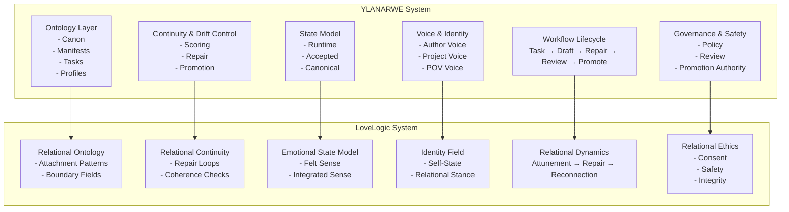

# 🌉 YLANARWE ↔ LoveLogic Mapping (Mermaid Diagram)

```mermaid
flowchart TD

%% --- YLANARWE LAYER ---
subgraph Y[YLANARWE System]
    Y1[Ontology Layer\n- Canon\n- Manifests\n- Tasks\n- Profiles]
    Y2[Continuity & Drift Control\n- Scoring\n- Repair\n- Promotion]
    Y3[State Model\n- Runtime\n- Accepted\n- Canonical]
    Y4[Voice & Identity\n- Author Voice\n- Project Voice\n- POV Voice]
    Y5[Workflow Lifecycle\nTask → Draft → Repair → Review → Promote]
    Y6[Governance & Safety\n- Policy\n- Review\n- Promotion Authority]
end

%% --- LOVELOGIC LAYER ---
subgraph L[LoveLogic System]
    L1[Relational Ontology\n- Attachment Patterns\n- Boundary Fields]
    L2[Relational Continuity\n- Repair Loops\n- Coherence Checks]
    L3[Emotional State Model\n- Felt Sense\n- Integrated Sense]
    L4[Identity Field\n- Self-State\n- Relational Stance]
    L5[Relational Dynamics\nAttunement → Repair → Reconnection]
    L6[Relational Ethics\n- Consent\n- Safety\n- Integrity]
end

%% --- MAPPINGS ---
Y1 --> L1
Y2 --> L2
Y3 --> L3
Y4 --> L4
Y5 --> L5
Y6 --> L6
```